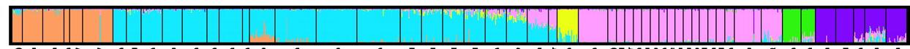

This is the manual to create [Structure](https://web.stanford.edu/group/pritchardlab/structure.html) plots and visualize it using [CLUMPAK](https://tau.evolseq.net/clumpak/)

## Step 1: edit the STRUCTURE file 
The STRUCURE format file you have generated using the populations program in Stacks needs a small adjustment. 

* Remove the first line (line with a #)
* add a TAB (to have two TABs at the first line)

## Step 2: download the [Structure software](https://web.stanford.edu/group/pritchardlab/structure.html)

## Step 3: Run it as follows

### For the GUI version

* set K 1-6
* set burnin to 10000
* set MCMC to 20000
* set number of iterations to 3
  

### For the commandline version
Edit the mainparams and extraparams files according to the input file. It's best to remove the marker names line and pop info column.

To get the number of loci, you need to count number of columns using this command : `cat file1 | awk 'BEGIN{FS="\t"};{print NF}'`

Edit the mainparams file according to the input file. 
    
```
#!/bin/bash

for i in {1..7} 
do
/opt/structure/structure -m mainparams_NY -e extraparams_NY -K $i -i ./populations_p2_r.7.structure -o ./try2_NY/out_${i}_1

/opt/structure/structure -m mainparams_NY -e extraparams_NY -K $i -i ./populations_p2_r.7.structure -o ./try2_NY/out_${i}_2

/opt/structure/structure -m mainparams_NY -e extraparams_NY -K $i -i ./populations_p2_r.7.structure -o ./try2_NY/out_${i}_3

done
```

## Step 4: Visualize the results in [CLUMPAK](https://clumpak.tau.ac.il/help.html)

Select and zip the "f" files, and upload them in [CLUMPAK](https://clumpak.tau.ac.il/help.html) for visualization and finding 'Best K'


