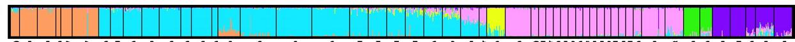

This is the manual to create [Structure](https://web.stanford.edu/group/pritchardlab/structure.html) plots and visualize it using [CLUMPAK](https://tau.evolseq.net/clumpak/)

## Step 1: edit the STRUCTURE file 
The STRUCURE format file you have generated using the populations program in Stacks need a small adjustment. 

* Remove the first line (with a #)
* add a TAB (to have two TABs at the first line)

## Step 2: download the [Structure software](https://web.stanford.edu/group/pritchardlab/structure.html)

## Step 3: Run it as follows

## Step 4: Visualize the results in [CLUMPAK](https://tau.evolseq.net/clumpak/)

