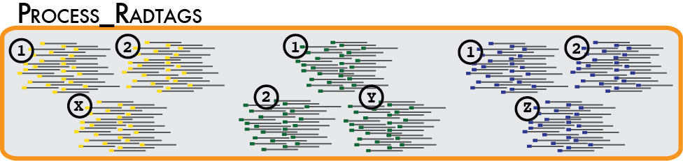
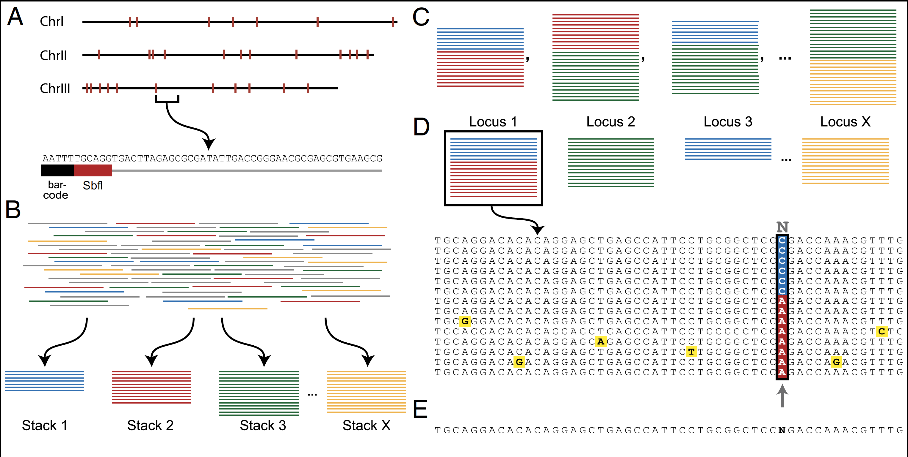
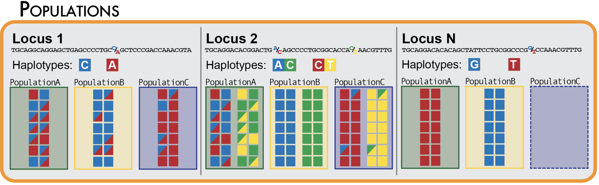

This is a tutorial to use the [Stacks](https://catchenlab.life.illinois.edu/stacks/manual/) pipeline to generate a VCF file from raw RAD-seq data

Created by Narcis, July 2024, updated August 2024 


## Step 0: cleaning the data from PhiX

This step is optional in our course (clean data is provided). For quality control and normalization, genome of PhiX (a bacteriophage) is added to the Illumina library for sequencing. Sometimes the sequencing centers don't perform PhiX removal. Here is the tutorial to do it.

We will use [HTStream](https://github.com/s4hts/HTStream) for removal of PhiX using this command:

```
#!/bin/bash
src=/home/ubuntu/narcis/raw_data

hts_SeqScreener --singleend-input $src/R1_001.fastq.gz \
-L R1_001.phix.json -f R1_001.phiX 
```


## Step 1: process_radtags



1)	Set up a directory structure on the server to hold your data in different steps

You do it as a “waterfall workspace”: (YOUR_NAME (samples, denovo_map, ref_map))

2)	Cleaning and de-multiplexing the sequences using process-radtags program manual [here](https://catchenlab.life.illinois.edu/stacks/manual/#clean)

You need to:

• Specify a set of barcodes using `nano` or `vi`. Use these barcodes:

``` 
ATCAGGTT  SW_AG_Aa_1p
AATACGAT	SW_BE_Lo_1t
GGCTATTC	SW_ZH_bu_1t
GTCCAACC	SW_ZH_We_1p
TTGCAGTA	Fr_ELB_1p
GTATCTGA	Fr_ELB_4t
TCTACTGA	Fr_ELB_5t
GGTCTCGA	Ge_MH5_1p
AATTGCGA	Ge_MH20_2p
GCGTACGA	Ge_MH21_1t
```

•	Specify the restriction enzyme used to construct the library (ecoRI)

•	Specify that process_radtags clean, discard, and rescue reads

Example command:

```
process_radtags -p /home/course/raw_data/phiX -o ./samples -b ./barcodes -e ecoRI -c -q -r -D --disable-rad-check --barcode-dist-1 2 --filter-illumina

```

Now, examine the results: the de-multiplexed sequences, and process_radtags.log file. What do you think about the content of the log file? Hint: use `cat` (for small files), `head`, `more` and `tail`.

Familiarize yourself with the format of the sequences (fastq format) and the quality (Phred scores). Here you find a good explanation: https://en.wikipedia.org/wiki/FASTQ_format 

## Step 2: denovo assembly


de novo assembly of RAD tags without a genome. Follow the manual [here](http://catchenlab.life.illinois.edu/stacks/comp/denovo_map.php)

•	Run the Stacks’ denovo_map.pl program (*It’s important that you set –T (number of threads) to 2, so that you don’t occupy the whole server!)

o	You need to specify a map specifying which individuals belong to which population.

Use `nano` or `vi` to make it as:

```
SW_AG_Aa_1p  Switzerland
SW_BE_Lo_1t  Switzerland
SW_ZH_bu_1t  Switzerland
SW_ZH_We_1p  Switzerland
Fr_ELB_1p  France
Fr_ELB_4t  France
Fr_ELB_5t  France
Ge_MH5_1p  Germany
Ge_MH20_2p  Germany
Ge_MH21_1t  Germany
```

Example command:

```
denovo_map.pl --samples ./samples --popmap ./popmaps/popmap --out-path ./denovo_M1_n1 --threads 2 -M 1 -n 1 -X "populations: --min-maf 0.2" -r 0.2 -p 2
```

## Step 3: population command


Finally run the populations program to extract a set of SNPs following the manual [here](http://catchenlab.life.illinois.edu/stacks/comp/populations.php)

example: 

```
populations -P ../denovo_M1_n1  -O ./pop_r.2_p2 -M ../popmaps/popmap -p 2 -r 0.2 --fstats --fst-correction --vcf --genepop --structure --plink -t 2 --write-single-snp
```

You can now use different population genetics or phylogenetic software for downstream analysis (e.g Structure, GenAlEx, RAxML,…)


