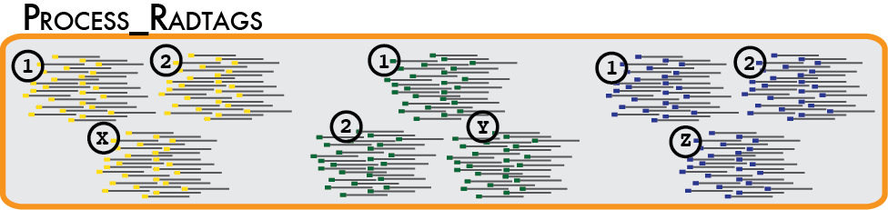

This is a tutorial to generate a VCF file using the [Stacks](https://catchenlab.life.illinois.edu/stacks/manual/) pipeline

Created by Narcis, July 2024, updated July 2024 

## Step 1: process_radtags

1)	Set up a directory structure on the server to hold your data in different steps

You do it as a “waterfall workspace”: working (clean (raw, samples), map (stacks))
Copy (don’t move!) the file containing raw Illumina sequences from “/home/workshop/Illumina_R1.fastq” into your raw directory

2)	Cleaning and de-multiplexing the sequences using process-radtags program manual [here](https://catchenlab.life.illinois.edu/stacks/manual/#clean)
You need to:
•	Specify a set of barcodes using `nano` or `vi`
Use these barcodes: 
AACCC<tab>ind1
AATTT	ind2		
ACCAT	ind3	
CTCTT	ind4
GGCCT	ind5

•	Specify the restriction enzyme used to construct the library (SbfI)
•	Specify that process_radtags clean, discard, and rescue reads

Now, examine the results: the de-multiplexed sequences, and process_radtags.log file. What do you think about the content of the log file? Hint: use cat (for small files), head, more and tail.
Familiarize yourself with the format of the sequences (fastq format) and the quality (Phred scores). Here you find a good explanation: https://en.wikipedia.org/wiki/FASTQ_format 

## Step 2: denovo assembly

## Step 3: population command

